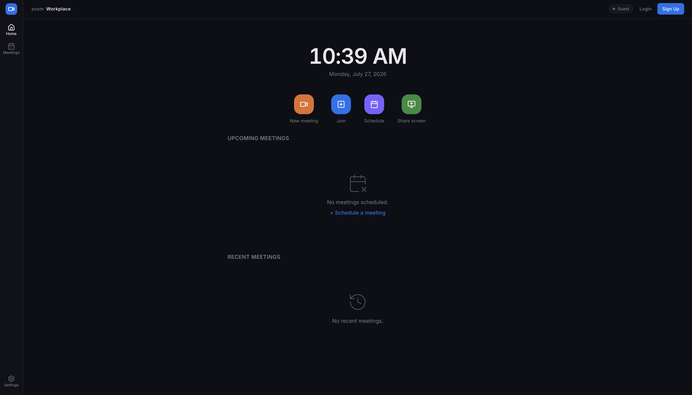
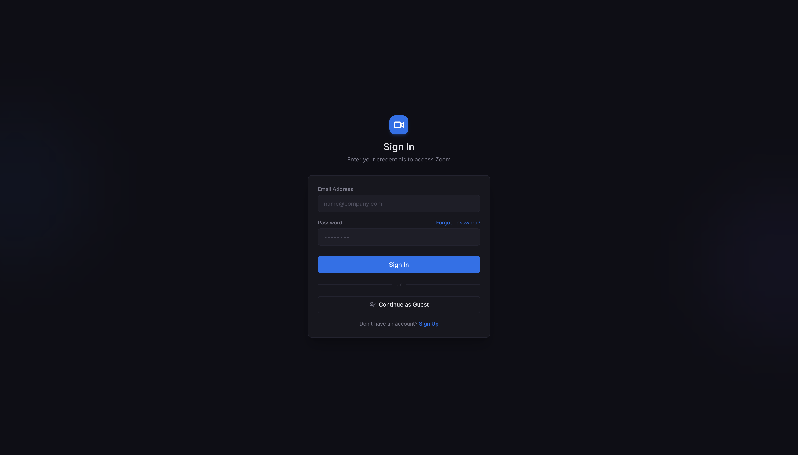
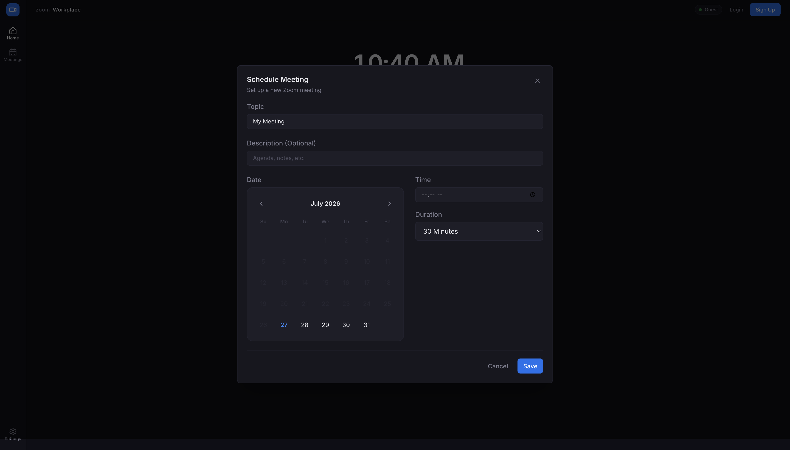
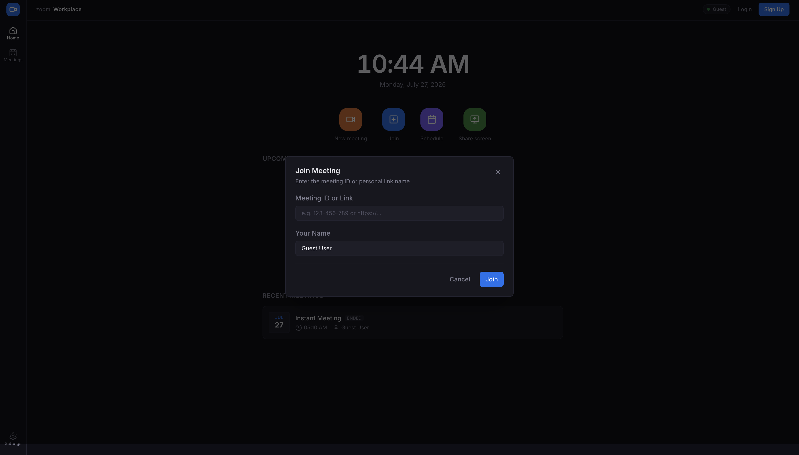
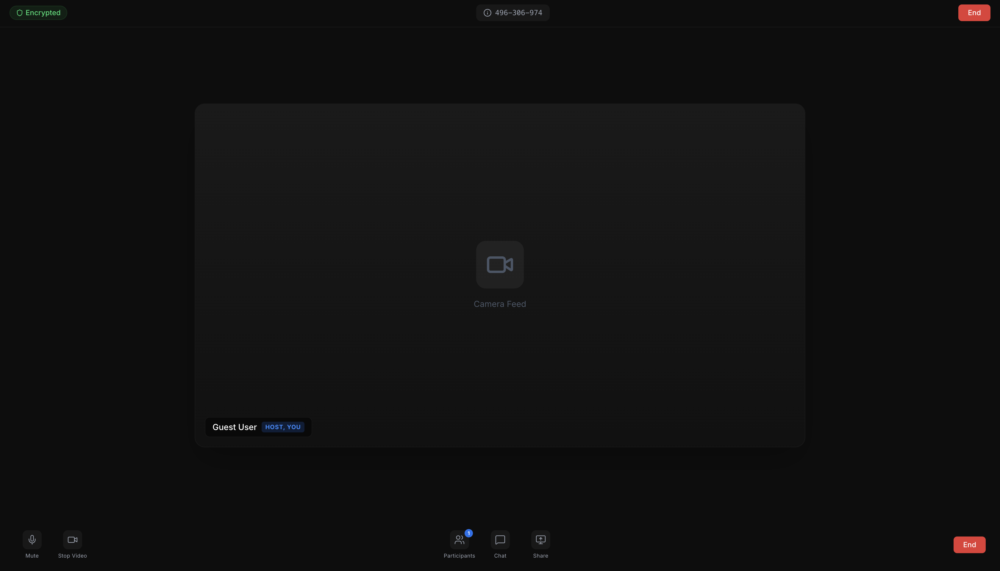
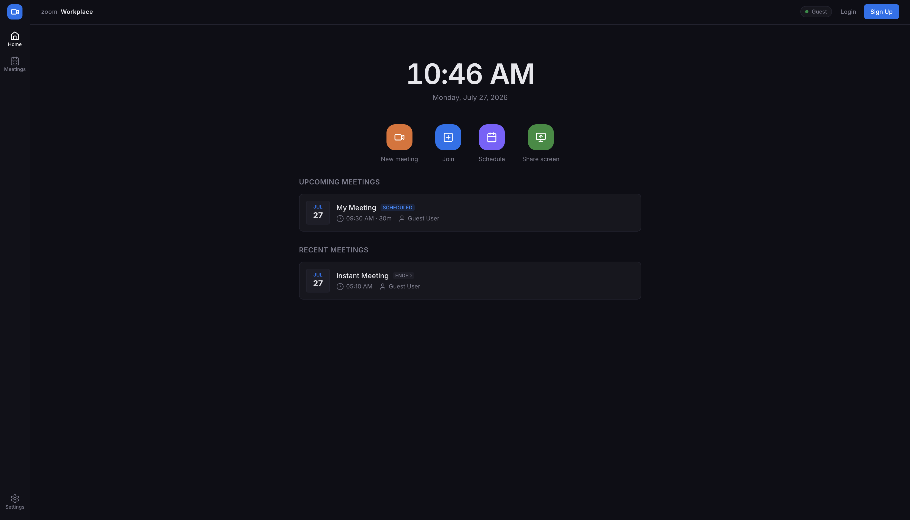

# 🎥 Zoom Clone

A modern Zoom-inspired video conferencing application built with **Next.js, FastAPI, and SQLite**, featuring instant meetings, scheduled meetings, authentication, guest access, and a responsive Zoom-like interface.

> Developed as a Full Stack Assignment.

---

## 🚀 Live Demo

**Frontend:** https://zoom-clone-frontend-vert.vercel.app

**Backend API:** https://zoom-clone-re9s.onrender.com

---

## 📂 GitHub Repository

https://github.com/utkarsh0885/zoom-clone

---

# ✨ Features

## Core Features

- ✅ Instant Meeting
- ✅ Schedule Meeting
- ✅ Join Meeting via Meeting ID
- ✅ Meeting Room
- ✅ Dashboard
- ✅ Upcoming Meetings
- ✅ Recent Meetings
- ✅ Meeting Details
- ✅ Copy Meeting ID
- ✅ Copy Invite Link
- ✅ Join from Invite Link

---

## Authentication

- ✅ User Registration
- ✅ User Login
- ✅ Guest Mode
- ✅ JWT Authentication
- ✅ Protected Routes

---

## Host Controls

- ✅ End Meeting
- ✅ Host-only Controls
- ✅ Meeting Ownership
- ✅ User-specific Meetings

---

## UI Features

- 🎨 Zoom Desktop Inspired Interface
- 🌙 Dark Theme
- 📱 Fully Responsive
- ⚡ Skeleton Loaders
- ✅ Toast Notifications
- ✅ Success Modals
- ✅ Error Handling
- ✅ Meeting Not Found Page

---

# 🛠 Tech Stack

## Frontend

- Next.js 15
- React 19
- TypeScript
- Tailwind CSS
- Axios
- React Hook Form
- Framer Motion
- Lucide React

---

## Backend

- FastAPI
- SQLAlchemy
- SQLite
- JWT Authentication
- Pydantic

---

# 📸 Screenshots

## Dashboard



---

## Login



---

## Schedule Meeting




---

## Join Meeting



---

## Meeting Room



---

## Upcoming Meetings


---

## Recent Meetings



---

# 📁 Project Structure

```
zoom-clone
│
├── backend
│   ├── app
│   ├── requirements.txt
│   └── main.py
│
├── frontend
│   ├── src
│   ├── public
│   ├── package.json
│   └── next.config.ts
│
└── screenshots
```

---

# ⚙️ Local Setup

## Clone Repository

```bash
git clone https://github.com/utkarsh0885/zoom-clone.git
```

```
cd zoom-clone
```

---

## Backend

```
cd backend

python -m venv venv

source venv/bin/activate

pip install -r requirements.txt

uvicorn app.main:app --reload
```

Backend runs on:

```
http://localhost:8000
```

---

## Frontend

```
cd frontend

npm install

npm run dev
```

Frontend runs on:

```
http://localhost:3000
```

---

# Environment Variables

## Backend

```
FRONTEND_URL=https://zoom-clone-frontend-vert.vercel.app
SECRET_KEY=your_secret_key
JWT_ALGORITHM=HS256
ACCESS_TOKEN_EXPIRE_MINUTES=30
```

---

## Frontend

```
NEXT_PUBLIC_API_URL=https://zoom-clone-re9s.onrender.com
```

---

# Production Deployment

## Frontend

- Vercel

## Backend

- Render

---

# Assignment Features Checklist

| Feature | Status |
|----------|--------|
| Dashboard | ✅ |
| Instant Meeting | ✅ |
| Schedule Meeting | ✅ |
| Join Meeting | ✅ |
| Meeting Room | ✅ |
| JWT Authentication | ✅ |
| Guest Mode | ✅ |
| Host Controls | ✅ |
| Responsive UI | ✅ |
| Copy Invite Link | ✅ |
| Recent Meetings | ✅ |
| Upcoming Meetings | ✅ |

---

# Future Improvements

- Video & Audio Streaming
- Screen Sharing
- Chat System
- Recording Meetings
- Waiting Room
- Participant Management

---

# Author

**Utkarsh Singh**

GitHub: https://github.com/utkarsh0885

---

⭐ If you found this project useful, consider giving it a star.
